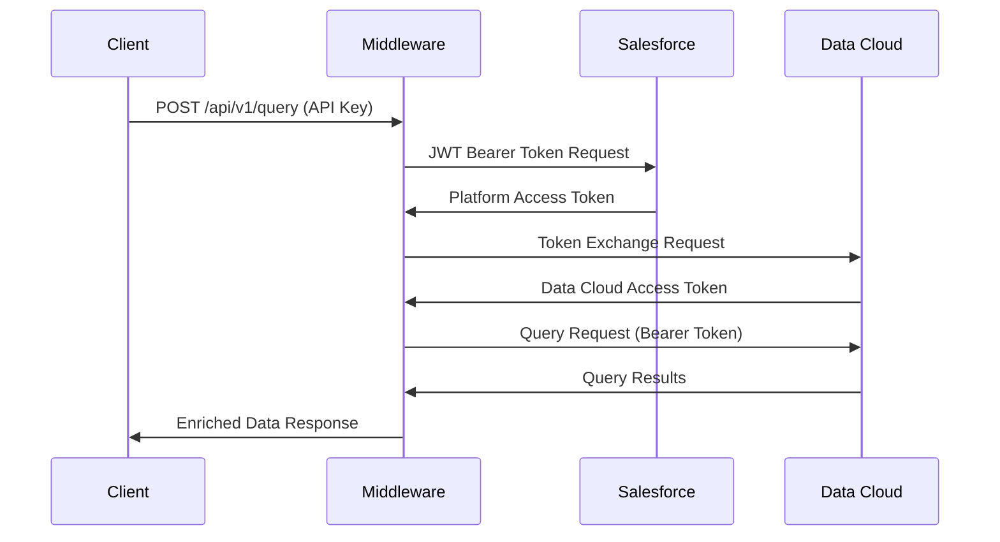

# Architecture Guide

## System Overview

The Salesforce Data Cloud-Integrated IDE Assistant implements a three-tier architecture designed for security, scalability, and maintainability. This document provides a comprehensive overview of the system's design, component interactions, and architectural decisions.

## 🏗️ Architectural Principles

### 1. Separation of Concerns

Each component has a clearly defined responsibility:

- **IDE Extension**: User interface and interaction
- **Middleware API**: Business logic, authentication, and data processing
- **Salesforce Data Cloud**: Authoritative data source

### 2. Security-First Design

- Credentials never leave the middleware server
- All external communication is authenticated
- Input validation and sanitization at every layer

### 3. Scalability Considerations

- Stateless middleware design
- Caching strategies for frequently accessed data
- Rate limiting and quota management

## 🔄 Data Flow Architecture

### Standard REST API Flow

```
┌─────────────┐    ┌──────────────┐    ┌─────────────┐
│   Developer │───►│  IDE Extension│───►│ Middleware  │
│             │    │              │    │    API      │
└─────────────┘    └──────────────┘    └─────────────┘
                           │                    │
                           ▼                    ▼
                    ┌──────────────┐    ┌─────────────┐
                    │   React UI   │    │ Salesforce  │
                    │   (Webview)  │    │ Data Cloud  │
                    └──────────────┘    └─────────────┘
```

### MCP Architecture Flow

```
┌─────────────┐    ┌──────────────┐    ┌─────────────┐
│   Developer │───►│  Cursor AI   │───►│ MCP Server  │
│             │    │    Agent     │    │ (Middleware)│
└─────────────┘    └──────────────┘    └─────────────┘
                           │                    │
                           ▼                    ▼
                    ┌──────────────┐    ┌─────────────┐
                    │ Tool Registry│    │ Salesforce  │
                    │ & Discovery  │    │ Data Cloud  │
                    └──────────────┘    └─────────────┘
```

## 🔐 Authentication Architecture

### Multi-Layer Authentication

The system implements a sophisticated authentication strategy with multiple layers:

1. **Client-Middleware Authentication**

   - API Key-based authentication
   - Secure storage using VS Code SecretStorage
   - Bearer token in Authorization header

2. **Middleware-Salesforce Authentication**

   - OAuth 2.0 JWT Bearer Flow
   - Digital certificate-based authentication
   - Automatic token refresh

3. **Salesforce-Data Cloud Authentication**
   - Token exchange for Data Cloud access
   - Tenant-specific authentication
   - Session management

### Authentication Flow Details



## 🏛️ Component Architecture

### IDE Extension Architecture

The extension follows the standard VS Code extension architecture:

```
extension/
├── src/
│   ├── extension.ts          # Main extension logic
│   ├── webview/
│   │   ├── App.tsx          # React root component
│   │   ├── components/      # React components
│   │   └── types/           # TypeScript definitions
│   └── types/
│       └── api.ts           # API type definitions
├── package.json             # Extension manifest
└── webpack.config.js        # Build configuration
```

**Key Features:**

- Webview-based React UI
- Message passing between extension and webview
- Secure credential storage
- Error handling and logging

### Middleware Architecture

The middleware implements both REST API and MCP server patterns:

```
middleware/
├── src/
│   ├── api/                 # REST API implementation
│   │   ├── routes/          # API endpoints
│   │   ├── middleware/      # Request processing
│   │   └── validators/      # Input validation
│   ├── mcp/                 # MCP server implementation
│   │   ├── tools/           # Tool definitions
│   │   ├── server.py        # MCP server
│   │   └── handlers/        # Tool handlers
│   ├── auth/                # Authentication logic
│   │   ├── jwt.py           # JWT handling
│   │   ├── oauth.py         # OAuth flow
│   │   └── tokens.py        # Token management
│   ├── models/              # Data models
│   ├── utils/               # Utility functions
│   └── main.py              # Application entry point
├── config/                  # Configuration files
└── tests/                   # Test suite
```

**Key Features:**

- FastAPI-based REST API
- MCP server with tool registry
- Comprehensive authentication
- Data enrichment and caching
- Error handling and logging

## 🔄 Data Processing Pipeline

### Query Processing Flow

1. **Input Validation**

   - Sanitize user input
   - Validate query parameters
   - Check authorization

2. **Query Translation**

   - Parse natural language
   - Map to SOQL/SQL queries
   - Apply query optimization

3. **Data Retrieval**

   - Execute authenticated requests
   - Handle rate limiting
   - Process pagination

4. **Data Enrichment**

   - Merge related data
   - Calculate derived fields
   - Format for display

5. **Response Formatting**
   - Structure JSON response
   - Apply formatting rules
   - Include metadata

## 🛡️ Security Architecture

### Security Layers

1. **Network Security**

   - HTTPS/TLS encryption
   - Firewall protection
   - Rate limiting

2. **Application Security**

   - Input validation
   - SQL injection prevention
   - XSS protection

3. **Authentication Security**

   - Multi-factor authentication
   - Token-based sessions
   - Secure credential storage

4. **Data Security**
   - Encryption at rest
   - Encryption in transit
   - Access control

### Security Best Practices

- **Principle of Least Privilege**: Each component has minimal required permissions
- **Defense in Depth**: Multiple security layers
- **Secure by Default**: Security features enabled by default
- **Regular Auditing**: Continuous security monitoring

## 📊 Performance Architecture

### Caching Strategy

1. **Authentication Caching**

   - Token caching with TTL
   - Automatic refresh before expiration
   - Fallback mechanisms

2. **Data Caching**

   - Redis-based caching
   - Cache invalidation strategies
   - Memory-efficient storage

3. **Query Optimization**
   - Query result caching
   - Pagination optimization
   - Connection pooling

### Scalability Considerations

1. **Horizontal Scaling**

   - Stateless middleware design
   - Load balancer support
   - Database connection pooling

2. **Vertical Scaling**
   - Resource monitoring
   - Performance profiling
   - Capacity planning

## 🔧 Configuration Management

### Environment-Based Configuration

The system uses environment variables for configuration:

```python
# Configuration structure
class Settings(BaseSettings):
    # Salesforce Configuration
    salesforce_username: str
    salesforce_consumer_key: str
    salesforce_private_key_path: str
    salesforce_instance_url: str

    # Middleware Configuration
    middleware_api_key: str
    middleware_host: str = "localhost"
    middleware_port: int = 8000

    # Data Cloud Configuration
    data_cloud_dataspace: str

    class Config:
        env_file = ".env"
```

### Configuration Validation

- Environment variable validation
- Required field checking
- Type conversion and validation
- Default value handling

## 🧪 Testing Architecture

### Testing Strategy

1. **Unit Testing**

   - Component-level testing
   - Mock external dependencies
   - Fast execution

2. **Integration Testing**

   - API endpoint testing
   - Authentication flow testing
   - Data flow testing

3. **End-to-End Testing**
   - Complete workflow testing
   - UI interaction testing
   - Performance testing

### Test Structure

```
tests/
├── unit/                    # Unit tests
│   ├── test_auth.py        # Authentication tests
│   ├── test_api.py         # API tests
│   └── test_mcp.py         # MCP tests
├── integration/             # Integration tests
│   ├── test_workflows.py   # Workflow tests
│   └── test_data_flow.py   # Data flow tests
└── e2e/                    # End-to-end tests
    ├── test_extension.py   # Extension tests
    └── test_performance.py # Performance tests
```

## 📈 Monitoring and Observability

### Logging Strategy

1. **Structured Logging**

   - JSON-formatted logs
   - Correlation IDs
   - Log levels

2. **Metrics Collection**

   - Request/response metrics
   - Performance metrics
   - Error rates

3. **Health Checks**
   - Service health endpoints
   - Dependency health checks
   - Alerting mechanisms

### Monitoring Components

- **Application Metrics**: Request counts, response times, error rates
- **System Metrics**: CPU, memory, disk usage
- **Business Metrics**: Query success rates, data enrichment metrics
- **Security Metrics**: Authentication failures, rate limit violations

## 🔄 Deployment Architecture

### Deployment Options

1. **Local Development**

   - Docker Compose setup
   - Hot reloading
   - Debug configuration

2. **Production Deployment**

   - Container orchestration
   - Load balancing
   - Auto-scaling

3. **CI/CD Pipeline**
   - Automated testing
   - Security scanning
   - Deployment automation

### Environment Management

- **Development**: Local development setup
- **Staging**: Pre-production testing
- **Production**: Live system deployment

## 🚀 Future Architecture Considerations

### Scalability Enhancements

1. **Microservices Architecture**

   - Service decomposition
   - API gateway implementation
   - Service mesh integration

2. **Event-Driven Architecture**

   - Event sourcing
   - Message queues
   - Stream processing

3. **Cloud-Native Features**
   - Kubernetes deployment
   - Service mesh
   - Observability stack

### Technology Evolution

1. **AI/ML Integration**

   - Query optimization
   - Data enrichment
   - Predictive analytics

2. **Advanced Security**
   - Zero-trust architecture
   - Advanced threat detection
   - Compliance automation

This architecture provides a solid foundation for building a secure, scalable, and maintainable Salesforce Data Cloud integration system that can evolve with changing requirements and technology trends.
